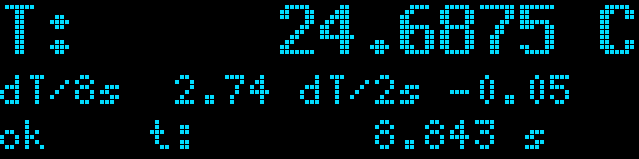

# MCP9600 Logger

A quick & simple thermocouple temperature sensor logger.

- STM32F103C8T6, 'blue pill' board.
- MCP9600 breakout from Adafruit.
- 0.91 inch OLED screen, 128x32 resolution, SSD1306

Display contents:
- Temperature
- Long duration (~9s) change
- Short duration (~2s) change
- Status of retrieving temperature
- Current Time



Log format to the USB serial port is simple ascii for logging with `cat`;
```
3920, 26.0000
4228, 26.0625
4594, 26.0000
```
First column is uptime of the MCU in milliseconds, second number is temperature in C.

# License
License is [`BSD-3-Clause`](./LICENSE).
